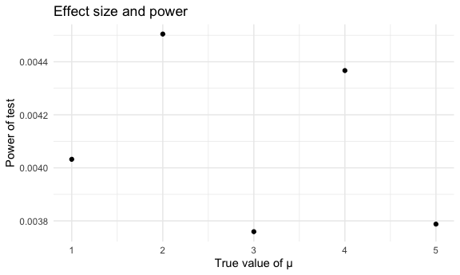

P8105 Homework 5
================
Diana Hernandez
2023-11-15

Load libraries and settings.

``` r
library(tidyverse)
```

    ## ── Attaching core tidyverse packages ──────────────────────── tidyverse 2.0.0 ──
    ## ✔ dplyr     1.1.3     ✔ readr     2.1.4
    ## ✔ forcats   1.0.0     ✔ stringr   1.5.0
    ## ✔ ggplot2   3.4.3     ✔ tibble    3.2.1
    ## ✔ lubridate 1.9.2     ✔ tidyr     1.3.0
    ## ✔ purrr     1.0.2     
    ## ── Conflicts ────────────────────────────────────────── tidyverse_conflicts() ──
    ## ✖ dplyr::filter() masks stats::filter()
    ## ✖ dplyr::lag()    masks stats::lag()
    ## ℹ Use the conflicted package (<http://conflicted.r-lib.org/>) to force all conflicts to become errors

``` r
library(rvest)
```

    ## 
    ## Attaching package: 'rvest'
    ## 
    ## The following object is masked from 'package:readr':
    ## 
    ##     guess_encoding

``` r
set.seed(1)

knitr::opts_chunk$set(
  fig.width = 6,
  fig.asp = .6,
  out.width = "90%"
)

theme_set(theme_minimal())

options(
  ggplot2.continuous.colour = "viridis",
  ggplot2.continuous.fill = "viridis"
)

scale_colour_discrete = scale_colour_viridis_d
scale_fill_discrete = scale_fill_viridis_d
```

# Problem 1

Import the data.

``` r
homicide_data =
  read_csv("https://raw.githubusercontent.com/washingtonpost/data-homicides/master/homicide-data.csv")
```

    ## Rows: 52179 Columns: 12
    ## ── Column specification ────────────────────────────────────────────────────────
    ## Delimiter: ","
    ## chr (9): uid, victim_last, victim_first, victim_race, victim_age, victim_sex...
    ## dbl (3): reported_date, lat, lon
    ## 
    ## ℹ Use `spec()` to retrieve the full column specification for this data.
    ## ℹ Specify the column types or set `show_col_types = FALSE` to quiet this message.

The raw data has 12 variables and 52179 observations. Some of the key
variables include victim name, victim age, victim race, victim sex, city
and state of homicide, and disposition.

Create `city_state` variable and create summary for the total number of
homicides and the number of unsolved homicides.

``` r
homicide_tidy =
  homicide_data |>
   mutate(
      city_state = paste0(city, ",", state)
    ) |>
  filter(!city_state == "Tulsa,AL")

homicide_df =
  homicide_tidy |>
  group_by(city_state) |>
  summarize(n_obs = n())

unsolved_homicide_df =
  homicide_tidy |>
  filter(disposition %in% c("Closed without arrest", "Open/No arrest")) |>
  group_by(city_state) |>
  summarize(n_obs = n())
```

Use the `prop.test` function for `city_state` == “Baltimore,MD”.

``` r
homicide_prop_test = function(x) {
  
  total_unsolved_df =
    unsolved_homicide_df |>
    filter(city_state == x) |> 
    select(n_obs)
  
  total_homicide_df =
    homicide_df |>
    filter(city_state == x) |> 
    select(n_obs)

  n_unsolved = total_unsolved_df$n_obs
  
  n_homicide = total_homicide_df$n_obs
  
  
result_tidy = broom::tidy(prop.test(x = n_unsolved, n = n_homicide, correct = FALSE))

}

homicide_prop_test("Baltimore,MD")
```

Use `prop.test` for all cities.

``` r
cities = unique(homicide_df$city_state)

prop_test_output =
  map(cities, homicide_prop_test)

prop_test_df =
  bind_rows(prop_test_output)

prop_test_df |>
  mutate(CI = paste0(conf.low, ",", conf.high)) |>
  select(estimate, CI)
```

    ## # A tibble: 50 × 2
    ##    estimate CI                                 
    ##       <dbl> <chr>                              
    ##  1    0.386 0.338538962461113,0.436236672783922
    ##  2    0.383 0.35331603274552,0.41430234795461  
    ##  3    0.646 0.627741062080148,0.662985215590964
    ##  4    0.462 0.415358886115476,0.509847053280381
    ##  5    0.434 0.399805186377872,0.46832801471938 
    ##  6    0.505 0.465431770927228,0.544279458247086
    ##  7    0.612 0.569770328000038,0.653154134299293
    ##  8    0.300 0.266782123693651,0.335152594484032
    ##  9    0.736 0.724087431420913,0.747310787757566
    ## 10    0.445 0.408671173782014,0.482421567929786
    ## # ℹ 40 more rows

# Problem 2

Import the data.

``` r
data_path = "./data/" 

import_csv = function(x) {
  read_csv(x) |>
  mutate(filename = x)
}

con_exp = list.files(data_path, pattern = "\\.csv$", full.names = T)

con_exp_df = map(con_exp, import_csv)
```

    ## Rows: 1 Columns: 8
    ## ── Column specification ────────────────────────────────────────────────────────
    ## Delimiter: ","
    ## dbl (8): week_1, week_2, week_3, week_4, week_5, week_6, week_7, week_8
    ## 
    ## ℹ Use `spec()` to retrieve the full column specification for this data.
    ## ℹ Specify the column types or set `show_col_types = FALSE` to quiet this message.
    ## Rows: 1 Columns: 8
    ## ── Column specification ────────────────────────────────────────────────────────
    ## Delimiter: ","
    ## dbl (8): week_1, week_2, week_3, week_4, week_5, week_6, week_7, week_8
    ## 
    ## ℹ Use `spec()` to retrieve the full column specification for this data.
    ## ℹ Specify the column types or set `show_col_types = FALSE` to quiet this message.
    ## Rows: 1 Columns: 8
    ## ── Column specification ────────────────────────────────────────────────────────
    ## Delimiter: ","
    ## dbl (8): week_1, week_2, week_3, week_4, week_5, week_6, week_7, week_8
    ## 
    ## ℹ Use `spec()` to retrieve the full column specification for this data.
    ## ℹ Specify the column types or set `show_col_types = FALSE` to quiet this message.
    ## Rows: 1 Columns: 8
    ## ── Column specification ────────────────────────────────────────────────────────
    ## Delimiter: ","
    ## dbl (8): week_1, week_2, week_3, week_4, week_5, week_6, week_7, week_8
    ## 
    ## ℹ Use `spec()` to retrieve the full column specification for this data.
    ## ℹ Specify the column types or set `show_col_types = FALSE` to quiet this message.
    ## Rows: 1 Columns: 8
    ## ── Column specification ────────────────────────────────────────────────────────
    ## Delimiter: ","
    ## dbl (8): week_1, week_2, week_3, week_4, week_5, week_6, week_7, week_8
    ## 
    ## ℹ Use `spec()` to retrieve the full column specification for this data.
    ## ℹ Specify the column types or set `show_col_types = FALSE` to quiet this message.
    ## Rows: 1 Columns: 8
    ## ── Column specification ────────────────────────────────────────────────────────
    ## Delimiter: ","
    ## dbl (8): week_1, week_2, week_3, week_4, week_5, week_6, week_7, week_8
    ## 
    ## ℹ Use `spec()` to retrieve the full column specification for this data.
    ## ℹ Specify the column types or set `show_col_types = FALSE` to quiet this message.
    ## Rows: 1 Columns: 8
    ## ── Column specification ────────────────────────────────────────────────────────
    ## Delimiter: ","
    ## dbl (8): week_1, week_2, week_3, week_4, week_5, week_6, week_7, week_8
    ## 
    ## ℹ Use `spec()` to retrieve the full column specification for this data.
    ## ℹ Specify the column types or set `show_col_types = FALSE` to quiet this message.
    ## Rows: 1 Columns: 8
    ## ── Column specification ────────────────────────────────────────────────────────
    ## Delimiter: ","
    ## dbl (8): week_1, week_2, week_3, week_4, week_5, week_6, week_7, week_8
    ## 
    ## ℹ Use `spec()` to retrieve the full column specification for this data.
    ## ℹ Specify the column types or set `show_col_types = FALSE` to quiet this message.
    ## Rows: 1 Columns: 8
    ## ── Column specification ────────────────────────────────────────────────────────
    ## Delimiter: ","
    ## dbl (8): week_1, week_2, week_3, week_4, week_5, week_6, week_7, week_8
    ## 
    ## ℹ Use `spec()` to retrieve the full column specification for this data.
    ## ℹ Specify the column types or set `show_col_types = FALSE` to quiet this message.
    ## Rows: 1 Columns: 8
    ## ── Column specification ────────────────────────────────────────────────────────
    ## Delimiter: ","
    ## dbl (8): week_1, week_2, week_3, week_4, week_5, week_6, week_7, week_8
    ## 
    ## ℹ Use `spec()` to retrieve the full column specification for this data.
    ## ℹ Specify the column types or set `show_col_types = FALSE` to quiet this message.
    ## Rows: 1 Columns: 8
    ## ── Column specification ────────────────────────────────────────────────────────
    ## Delimiter: ","
    ## dbl (8): week_1, week_2, week_3, week_4, week_5, week_6, week_7, week_8
    ## 
    ## ℹ Use `spec()` to retrieve the full column specification for this data.
    ## ℹ Specify the column types or set `show_col_types = FALSE` to quiet this message.
    ## Rows: 1 Columns: 8
    ## ── Column specification ────────────────────────────────────────────────────────
    ## Delimiter: ","
    ## dbl (8): week_1, week_2, week_3, week_4, week_5, week_6, week_7, week_8
    ## 
    ## ℹ Use `spec()` to retrieve the full column specification for this data.
    ## ℹ Specify the column types or set `show_col_types = FALSE` to quiet this message.
    ## Rows: 1 Columns: 8
    ## ── Column specification ────────────────────────────────────────────────────────
    ## Delimiter: ","
    ## dbl (8): week_1, week_2, week_3, week_4, week_5, week_6, week_7, week_8
    ## 
    ## ℹ Use `spec()` to retrieve the full column specification for this data.
    ## ℹ Specify the column types or set `show_col_types = FALSE` to quiet this message.
    ## Rows: 1 Columns: 8
    ## ── Column specification ────────────────────────────────────────────────────────
    ## Delimiter: ","
    ## dbl (8): week_1, week_2, week_3, week_4, week_5, week_6, week_7, week_8
    ## 
    ## ℹ Use `spec()` to retrieve the full column specification for this data.
    ## ℹ Specify the column types or set `show_col_types = FALSE` to quiet this message.
    ## Rows: 1 Columns: 8
    ## ── Column specification ────────────────────────────────────────────────────────
    ## Delimiter: ","
    ## dbl (8): week_1, week_2, week_3, week_4, week_5, week_6, week_7, week_8
    ## 
    ## ℹ Use `spec()` to retrieve the full column specification for this data.
    ## ℹ Specify the column types or set `show_col_types = FALSE` to quiet this message.
    ## Rows: 1 Columns: 8
    ## ── Column specification ────────────────────────────────────────────────────────
    ## Delimiter: ","
    ## dbl (8): week_1, week_2, week_3, week_4, week_5, week_6, week_7, week_8
    ## 
    ## ℹ Use `spec()` to retrieve the full column specification for this data.
    ## ℹ Specify the column types or set `show_col_types = FALSE` to quiet this message.
    ## Rows: 1 Columns: 8
    ## ── Column specification ────────────────────────────────────────────────────────
    ## Delimiter: ","
    ## dbl (8): week_1, week_2, week_3, week_4, week_5, week_6, week_7, week_8
    ## 
    ## ℹ Use `spec()` to retrieve the full column specification for this data.
    ## ℹ Specify the column types or set `show_col_types = FALSE` to quiet this message.
    ## Rows: 1 Columns: 8
    ## ── Column specification ────────────────────────────────────────────────────────
    ## Delimiter: ","
    ## dbl (8): week_1, week_2, week_3, week_4, week_5, week_6, week_7, week_8
    ## 
    ## ℹ Use `spec()` to retrieve the full column specification for this data.
    ## ℹ Specify the column types or set `show_col_types = FALSE` to quiet this message.
    ## Rows: 1 Columns: 8
    ## ── Column specification ────────────────────────────────────────────────────────
    ## Delimiter: ","
    ## dbl (8): week_1, week_2, week_3, week_4, week_5, week_6, week_7, week_8
    ## 
    ## ℹ Use `spec()` to retrieve the full column specification for this data.
    ## ℹ Specify the column types or set `show_col_types = FALSE` to quiet this message.
    ## Rows: 1 Columns: 8
    ## ── Column specification ────────────────────────────────────────────────────────
    ## Delimiter: ","
    ## dbl (8): week_1, week_2, week_3, week_4, week_5, week_6, week_7, week_8
    ## 
    ## ℹ Use `spec()` to retrieve the full column specification for this data.
    ## ℹ Specify the column types or set `show_col_types = FALSE` to quiet this message.

``` r
final_con_exp_data = bind_rows(con_exp_df)
```

Data wrangling.

``` r
tidy_con_exp_data =
  final_con_exp_data |>
  mutate(
    subject_id = row_number(),
    control_arm = ifelse(subject_id < 11, "Control", "Experimental")
    ) |>
  select(subject_id, control_arm, everything(), -filename) |>
  pivot_longer(
    week_1:week_8,
    names_to = "week",
    names_prefix = "week_",
    values_to = "observations"
  )
```

Spaghetti plot.

``` r
con_exp_plot =
tidy_con_exp_data |> 
  ggplot(aes(x = week, y = observations, group = subject_id, color = subject_id)) +
  geom_line() +
  labs(
    title = "Observations over time by subject",
    x = "Week",
    y = "Observations",
    color = "Subject ID"
    )

con_exp_plot
```


Since subjects in the experimental group are 11-20, you can see that
their observations over time are higher than those subjects in the
control group (1-10).

# Problem 3

Create function. Set Mu = 0.

``` r
one_samp_ttest = function(n = 30, sigma = 5, mu = 0) {
  
sample_data = 
  tibble(
      rnorm(n, mean = mu, sd = sigma),
    ) 
  
broom::tidy(t.test(sample_data, mu = 0, alternative = "two.sided"))
  
}
```

Generate 5000 datasets from the model.

``` r
ttest_results_df = 
  expand_grid(
    sample_size = 30,
    iter = 1:5000
  ) |> 
  mutate(
    estimate_df = map(sample_size, one_samp_ttest)
  ) |> 
  unnest(estimate_df)

ttest_results_df |>
  select(estimate, p.value)
```

    ## # A tibble: 5,000 × 2
    ##    estimate p.value
    ##       <dbl>   <dbl>
    ##  1    0.412  0.629 
    ##  2    0.664  0.368 
    ##  3    0.551  0.534 
    ##  4    0.567  0.487 
    ##  5   -1.65   0.0599
    ##  6    1.19   0.229 
    ##  7    0.334  0.738 
    ##  8   -1.19   0.209 
    ##  9    0.122  0.887 
    ## 10    0.684  0.472 
    ## # ℹ 4,990 more rows

Perform `t.test` for μ = {1,2,3,4,5,6}.

``` r
t_test_multiple_means = function(n = 30, sigma = 5, population_mean) {

  perform_t_test = function(mu) {
    sample_data = 
      tibble(
        rnorm(n, mean = population_mean, sd = sigma),
    ) 
    
  t_test_result = broom::tidy(t.test(sample_data, mu = mu, alternative = "two.sided"))

  }
  
  t_test_results = map(population_mean, perform_t_test) 
  
}

population_mean = c(1, 2, 3, 4, 5)

multiple_mu_results = t_test_multiple_means(n = 30, sigma = 5, population_mean)
```

Generate 5000 datasets for μ = {1,2,3,4,5,6}.

``` r
results_df = 
  expand_grid(
    sample_size = 30,
    population_mean = c(1, 2, 3, 4, 5),
    iter = 1:5000
  ) |> 
  mutate(
    estimate_df = 
      map2(sample_size, population_mean, \(n, population_mean) t_test_multiple_means(n = 30, sigma = 5, population_mean))
  ) |>
  unnest(estimate_df) |>
  unnest(estimate_df)
```

Create plots.

Power and effect size plot.

``` r
power_plot_df = 
  results_df |>
  select(population_mean, estimate, p.value) |>
  group_by(population_mean) |>
  summarize(n_obs = n()) |>
  mutate(props = round(n_obs / sum(n_obs), 2)) |>
  ggplot(aes(x = population_mean, y = props)) +
  geom_point() +
  labs(
    title = "Effect size and power",
    x = "True value of μ",
    y = "Power of test"
  )

power_plot_df
```



There is no association between effect size and power. The power of the
test stays the same across true values of mu.

Average estimate of μ and true value of μ

``` r
estimate_plot_df =
  results_df |>
  group_by(population_mean) |>
  summarize(
    mean_mu = mean(estimate)
  ) |>
  ggplot(aes(x = population_mean, y = mean_mu)) +
  geom_point() +
  labs(
    title = "Average estimate of μ and true value of μ.",
    x = "True value of μ",
    y = "Average estimate of μ"
  )

estimate_plot_df
```


Only in samples for which the null was rejected.

``` r
rejected_null_plot_df =
  results_df |>
  filter(p.value < 0.05) |>
  group_by(population_mean) |>
  summarize(
    mean_mu = mean(estimate)
  ) |>
  ggplot(aes(x = population_mean, y = mean_mu)) +
  geom_point() +
  labs(
    title = "Average estimate of μ and true value of μ.",
    x = "True value of μ",
    y = "Average estimate of μ"
  )

rejected_null_plot_df
```


The sample average of μ̂ across tests for which the null is rejected
approximately equal to the true value of μ.
